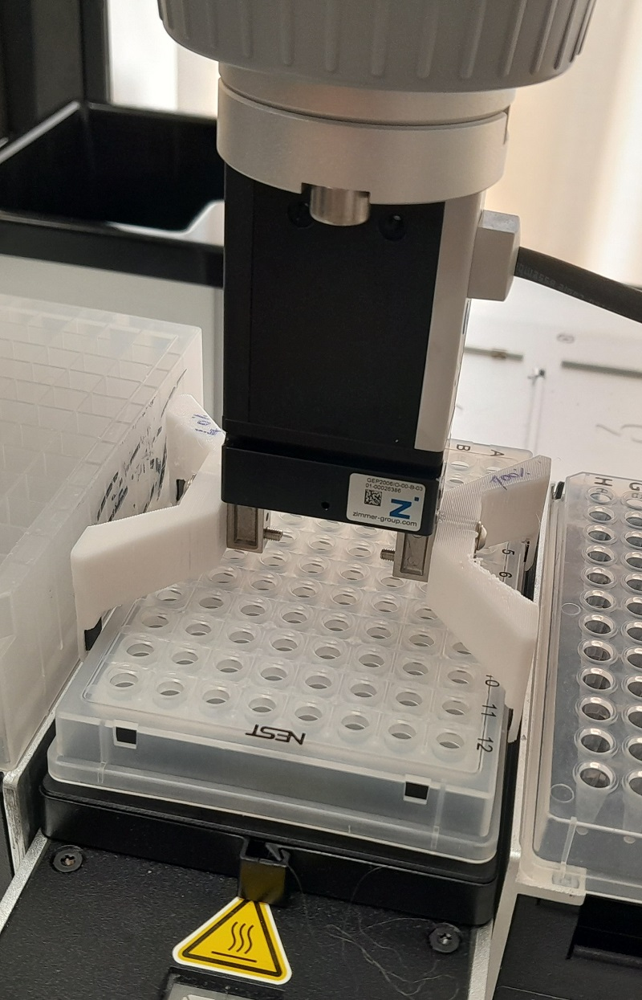

# Gripper for EVA robot

Here you can find 3D model and STL files to produce fingers for a gripper mounted on the EVA robot.

## Why is this needed

We need this to move plates.
Fingers are designed to be used with ANSI/SLAS plates, gripped on the short side.

## Gripper

Fingers are designed to be used with gripper equipped on the EVA: **Zimmer GEP-2006IO-00-B-03** 

## 3D model

The 3D model has been developed with Fusion360 software; each final finger is composed of two parts:
1. the main gripper;
2. two rubbery pad that have to be glued on the main gripper.

## Materials

For each finger you need: 
- 1x main finger, printed in hard plastic eg. **PETG**;
- 2x rubbery pads, printed in rubbery material to increase friction between fingers and plate, eg. **TPU95**.